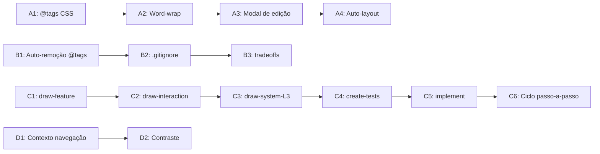

# 📋 Plano de Implementação — Sistema de Menções, UI/UX e Ciclo de Execução

## Visão Geral

Implementação das melhorias especificadas, dividida em **4 frentes paralelas** para maximizar velocidade sem conflitos.

---

## Frente A — Frontend: Sistema de @tags e UI/UX (draw-editor)

### A1. Estilização Visual de @tags (gradiente vermelho→laranja)
- **Arquivo:** [`CustomNode.tsx`](file:///Users/alexalves/Movies/stdd/draw-editor/src/components/CustomNode.tsx)
- **Arquivo:** [`QuestionsModal.tsx`](file:///Users/alexalves/Movies/stdd/draw-editor/src/components/QuestionsModal.tsx)
- **Arquivo:** [`index.css`](file:///Users/alexalves/Movies/stdd/draw-editor/src/index.css)
- **O que fazer:**
  - Criar função `renderMentions(text)` que detecta `@Looper`, `@developer`, `@OBS` em strings e retorna JSX com ``
  - CSS: gradiente `background: linear-gradient(135deg, #ef4444, #f97316)` com `-webkit-background-clip: text`
  - Aplicar nos prompts das perguntas, descrições de nós e labels

### A2. Quebra de Linha em Perguntas Longas
- **Arquivo:** [`index.css`](file:///Users/alexalves/Movies/stdd/draw-editor/src/index.css) (`.question-prompt-input`)
- **O que fazer:**
  - Trocar o `<input>` do prompt de pergunta por `<textarea>` com auto-resize
  - Aplicar `word-wrap: break-word; overflow-wrap: anywhere;` no campo de prompt
  - Garantir que o texto não fique truncado

### A3. Modal de Edição de Descrição (Nível 2)
- **Arquivo:** Novo componente [`NodeEditModal.tsx`](file:///Users/alexalves/Movies/stdd/draw-editor/src/components/NodeEditModal.tsx)
- **Arquivo:** [`CustomNode.tsx`](file:///Users/alexalves/Movies/stdd/draw-editor/src/components/CustomNode.tsx)
- **Arquivo:** [`App.tsx`](file:///Users/alexalves/Movies/stdd/draw-editor/src/App.tsx)
- **Arquivo:** [`index.css`](file:///Users/alexalves/Movies/stdd/draw-editor/src/index.css)
- **O que fazer:**
  - Duplo clique na descrição abre modal estilizado com textarea amplo
  - Modal usa o design system existente (`.app-dialog`, `.dialog-content`, etc.)
  - Exibir label (editável) + descrição (textarea expandido) + metadados do nó

### A4. Melhorias no Auto-Layout
- **Arquivo:** [`layout.ts`](file:///Users/alexalves/Movies/stdd/draw-editor/src/layout.ts)
- **O que fazer:**
  - Aumentar `V_GAP` e `H_GAP` para fluxogramas grandes
  - Adicionar detecção de sobreposição pós-layout com nudge iterativo
  - Melhorar distribuição em ranks com muitos nós (> MAX_PER_COL)

---

## Frente B — Backend: Processamento de @tags e .gitignore

### B1. Auto-remoção de @tags quando pergunta é respondida
- **Arquivo:** [`draw.py`](file:///Users/alexalves/Movies/stdd/src/looper/draw.py)
- **O que fazer:**
  - Na função de persistência de draws, ao salvar perguntas com resposta preenchida, remover `@Looper` e `@developer` do prompt automaticamente
  - Para `@OBS`: ler a observação, incorporar no contexto e remover a tag

### B2. Respeito ao .gitignore na contagem de linhas
- **Arquivo:** [`core.py`](file:///Users/alexalves/Movies/stdd/src/looper/core.py)
- **O que fazer:**
  - Na função de contagem de linhas de diff, usar `git ls-files` ou parsear `.gitignore` para excluir `node_modules/`, `.venv/`, etc.
  - Estado atual já ignora esses diretórios na constante `INTERNAL_STATE_DIRECTORIES` e no set `ignored` — validar que `runs` respeita

### B3. Remoção da chave `tradeoffs` obsoleta do contrato
- **Arquivos:** [`draw.py`](file:///Users/alexalves/Movies/stdd/src/looper/draw.py), [`types.ts`](file:///Users/alexalves/Movies/stdd/draw-editor/src/types.ts)
- **Decisão:** A chave `tradeoffs` existe em 9 draws e no tipo TS. Avaliar se:
  - (a) Remover completamente e migrar dados existentes
  - (b) Depreciar mas manter retrocompatibilidade
  - **Recomendação:** Depreciar — aceitar na leitura, não emitir na escrita

---

## Frente C — Skills: Diretrizes de Escopo e Ciclo de Execução

### C1. Atualizar `draw-feature/SKILL.md` (Nível 1)
- Reforçar foco em integrações externas, infraestrutura, deploy
- Explicitar que não deve conter regras de negócio locais detalhadas

### C2. Atualizar `draw-interaction/SKILL.md`
- Expandir escopo: não restringir apenas a perguntas pontuais
- Incluir inserção de nós e conexões como parte do escopo

### C3. Atualizar `draw-system-level-3/SKILL.md`
- Permitir modelagem do zero (inclusive repos vazios)
- Não presumir existência de codebase prévia

### C4. Atualizar `create-tests/SKILL.md`
- Testes robustos: asserções funcionais reais (banco, API)
- Não requerer validação manual repetitiva para cada detalhe já aprovado

### C5. Atualizar `implement/SKILL.md`
- **Bootstrap task:** primeira task = setup de infra (.env, libs, design.md)
- **Task final de nó L2:** verificação funcional + associação de símbolos
- **Task final do backlog:** e2e do MVP

### C6. Ciclo de Execução Passo-a-Passo
- **Todas as skills de execução:** reforçar uma task por vez
- Cursor anti-burla: validação intermediária obrigatória
- Parser de contexto de navegação: injetar nó anterior + tipo de conexão

---

## Frente D — Backlog Backend: Contexto de Navegação e Contraste

### D1. Parser de Contexto de Navegação
- **Arquivo:** [`backlog.py`](file:///Users/alexalves/Movies/stdd/src/looper/backlog.py)
- **O que fazer:**
  - Ao gerar task do backlog, incluir `origin_node` (nó anterior), `origin_edge` (tipo de conexão), e `access_paths` (todas as telas que dão acesso)
  - Extrair do grafo de edges qual nó "from" aponta para o nó da task atual

### D2. Script de Contraste Visual (Acessibilidade)
- **Arquivo:** Novo script em [`.looper/adapters/`](file:///Users/alexalves/Movies/stdd/.looper/adapters/)
- **O que fazer:**
  - Script headless que checa contraste básico (texto branco sobre fundo branco, etc.)
  - Integrar como capability opcional no `config.json`

---

## Ordem de Execução

> **Frentes A, B, C e D podem ser executadas em paralelo** — sem conflitos de arquivo.

---

## Validação Final

1. `npm run build` no draw-editor para verificar erros TS
2. `looper test` para rodar a suite Python existente
3. `uv tool install --force --editable .` para validar instalação
4. `looper init` para confirmar que skills atualizadas são instaladas
