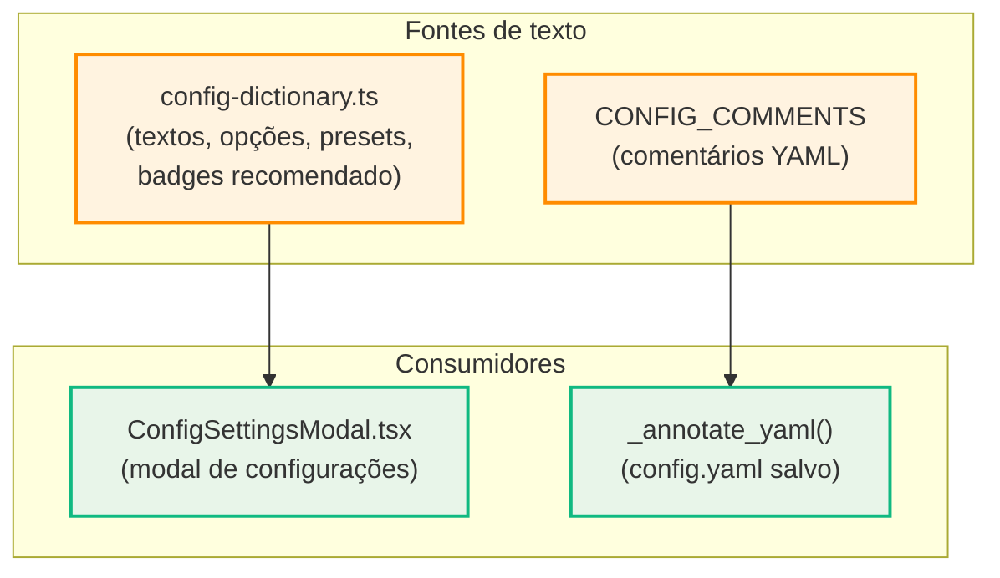

# Plano: Configurações com linguagem clara e orientação contextual

## Objetivo

As configurações do Looper têm muitas opções úteis, mas a linguagem usada hoje é técnica e voltada para quem já conhece o projeto. O objetivo é reescrever toda a camada de apresentação e adicionar orientação visual (presets, badges, hints) para que qualquer pessoa consiga configurar o projeto sem documentação externa.

> [!IMPORTANT]
> **Nenhuma lógica de negócio ou comportamento muda.** Apenas a camada de apresentação textual e visual será alterada. Os nomes das chaves YAML permanecem idênticos.

## Decisões confirmadas

| # | Decisão | Status |
|---|---------|--------|
| 1 | Substituir "L2"/"L3"/"L4" por "telas"/"backend"/"detalhes técnicos" | ✅ |
| 2 | Dicas contextuais visíveis por padrão; ícone `?` expande detalhe longo | ✅ |
| 3 | Badge "Recomendado" na opção padrão de cada grupo | ✅ |
| 4 | 8 presets rápidos + "Personalizado" separado fora do grid | ✅ |
| — | Idioma: manter tudo em português | ✅ |

---

## Proposed Changes

### Componente 1: Dicionário centralizado de textos

#### [NEW] `draw-editor/src/config-dictionary.ts`

Centraliza todos os textos da UI, opções com flag `recommended`, e os 8 presets + Personalizado.

```typescript
/* ═══════════════════════════════════════════════════════════════
   Dicionário de textos da UI de configurações do Looper
   ═══════════════════════════════════════════════════════════════ */

export interface ConfigText {
  label: string;
  description: string;
  hint: string;
  detail?: string;
}

export interface OptionText {
  label: string;
  tooltip: string;
  recommended?: boolean;
}

export interface ConfigPreset {
  id: string;
  label: string;
  icon: string;
  description: string;
  values: Record<string, any>;
}

// ─── Textos dos campos ──────────────────────────────────────

export const CONFIG_TEXTS: Record<string, ConfigText> = {
  'backlog.development_mode': {
    label: 'Ordem de desenvolvimento',
    description: 'Define se as telas são criadas antes de toda a lógica ou se telas e lógica se alternam.',
    hint: 'Na maioria dos projetos, "Telas primeiro" facilita a revisão visual antes de conectar o backend.',
    detail: 'No modo "Telas primeiro" (separated), o Looper conclui todas as telas e navegação antes de '
          + 'iniciar controllers, models e regras de negócio. No modo "Intercalado" (sequential), cada '
          + 'feature recebe tela e backend em sequência. O modo separado é mais previsível para revisão visual.',
  },
  'backlog.task_delivery_scope': {
    label: 'Tamanho de cada entrega',
    description: 'Controla quanto trabalho é entregue de cada vez.',
    hint: 'Entregas menores facilitam a revisão. Entregas por nó são mais rápidas quando o padrão está estável.',
    detail: '"Uma tarefa por vez" entrega mudanças pequenas e focadas. "Nó completo" agrupa a tela principal '
          + 'com seus subfluxos relacionados numa única entrega, reduzindo o número de ciclos de revisão.',
  },
  'backlog.test_loop_enabled': {
    label: 'Criar testes antes de implementar',
    description: 'Quando ativo, o Looper exige que os testes existam antes de liberar a implementação.',
    hint: 'Recomendado para projetos novos. Desative se você já tem testes escritos ou quer implementar direto.',
  },
  'backlog.bootstrap_task': {
    label: 'Preparação inicial do projeto',
    description: 'Cria uma tarefa automática para configurar a stack, runners e análise antes das features.',
    hint: 'Útil na primeira vez. Em projetos já configurados, pode ser desativado.',
  },
  'backlog.final_verification_task': {
    label: 'Verificação final',
    description: 'Adiciona uma conferência completa ao final de todo o backlog.',
    hint: 'Funciona como um "smoke test" da jornada inteira depois que todas as tarefas terminam.',
  },
  'backlog.test_scope': {
    label: 'O que será testado',
    description: 'Escolha quais partes do projeto recebem testes automáticos.',
    hint: 'Para cobertura completa, use "Telas e backend". Para projetos visuais, "Somente telas" pode bastar.',
  },
  'backlog.test_loop.mode': {
    label: 'Ordem dos testes',
    description: 'Define a sequência usada para criar e liberar testes.',
    hint: 'Em projetos com muitas telas, "Todas as telas primeiro" mantém a revisão visual consistente.',
  },
  'backlog.test_loop.batch_size': {
    label: 'Testes por lote',
    description: 'Quantos testes são criados e liberados a cada avanço do backlog.',
    hint: 'Valor 1 é mais controlado. Aumente para 3 quando o fluxo estiver estável.',
  },
  'backlog.implementation_loop.mode': {
    label: 'Ordem da implementação',
    description: 'Define a sequência usada para implementar features.',
    hint: '"Nó e depois detalhes" é o mais comum: conclui o comportamento principal e depois detalha.',
  },
  'backlog.implementation_loop.batch_size': {
    label: 'Implementações por lote',
    description: 'Quantas implementações são entregues a cada avanço do backlog.',
    hint: 'Valor 1 é o mais seguro. Aumente quando o padrão das tarefas estiver previsível.',
  },
  'backlog.l4_group_size': {
    label: 'Detalhes técnicos por entrega',
    description: 'Quantos detalhes técnicos são entregues junto com cada funcionalidade backend.',
    hint: 'O padrão 3 funciona bem. Reduza para revisões mais focadas, aumente para menos interrupções.',
  },
  'contract.enabled': {
    label: 'Validar documentação dos testes',
    description: 'Confere se os testes seguem o formato e a linguagem esperados pelo projeto.',
    hint: 'Quando ativo, um teste sem descrição ou com formato errado é bloqueado e mostra o motivo.',
  },
  'static_analysis.enabled': {
    label: 'Análise de qualidade do código',
    description: 'Calcula métricas de complexidade, dependências e estrutura após cada mudança.',
    hint: 'Precisa de um adaptador configurado. Sem ele, a opção fica sem efeito.',
  },
  'review.enabled': {
    label: 'Revisão automática por agente',
    description: 'Executa uma revisão local usando um agente de IA após cada tarefa concluída.',
    hint: 'O agente padrão é configurável. A revisão cria evidências mas não modifica código.',
  },
};

// ─── Textos das opções (com flag recommended) ───────────────

export const OPTION_TEXTS: Record<string, Record<string, OptionText>> = {
  'backlog.development_mode': {
    sequential: {
      label: 'Intercalado',
      tooltip: 'Cada feature recebe tela e backend em sequência, na ordem do backlog.',
    },
    separated: {
      label: 'Telas primeiro',
      tooltip: 'Todas as telas e navegação são concluídas antes de iniciar regras e lógica de backend.',
      recommended: true,
    },
  },
  'backlog.task_delivery_scope': {
    task: {
      label: 'Uma tarefa por vez',
      tooltip: 'Entregas pequenas e focadas, mais fáceis de revisar.',
      recommended: true,
    },
    node: {
      label: 'Nó completo',
      tooltip: 'Agrupa a tela principal e seus subfluxos numa única entrega.',
    },
  },
  'backlog.test_scope': {
    l2: {
      label: 'Somente telas',
      tooltip: 'Testa botões, ações, navegação e estados visuais com Playwright.',
    },
    l3: {
      label: 'Somente backend',
      tooltip: 'Testa controllers, models, regras de negócio e integrações.',
    },
    both: {
      label: 'Telas e backend',
      tooltip: 'Cria testes para as duas camadas conforme cada tarefa for liberada.',
      recommended: true,
    },
  },
  'backlog.test_loop.mode': {
    task_order: {
      label: 'Ordem do backlog',
      tooltip: 'Segue a sequência definida pelas tarefas do backlog.',
      recommended: true,
    },
    node_complete: {
      label: 'Completar nó',
      tooltip: 'Só avança quando todos os testes do nó atual estiverem prontos.',
    },
    node_then_children: {
      label: 'Nó e depois detalhes',
      tooltip: 'Faz o teste principal e depois os testes dos subfluxos.',
    },
    all_level2_then_level3: {
      label: 'Todas as telas primeiro',
      tooltip: 'Cria todos os testes de tela antes de testar o backend.',
    },
  },
  'backlog.implementation_loop.mode': {
    task_order: {
      label: 'Ordem do backlog',
      tooltip: 'Segue a sequência definida pelas tarefas do backlog.',
      recommended: true,
    },
    node_complete: {
      label: 'Completar nó',
      tooltip: 'Só avança quando toda a implementação do nó atual estiver pronta.',
    },
    node_then_children: {
      label: 'Nó e depois detalhes',
      tooltip: 'Implementa o comportamento principal e depois os detalhes técnicos.',
    },
    all_level2_then_level3: {
      label: 'Todas as telas primeiro',
      tooltip: 'Implementa todas as telas antes de iniciar o backend.',
    },
  },
};

// ─── 8 Presets + Personalizado ──────────────────────────────

export const CONFIG_PRESETS: ConfigPreset[] = [
  {
    id: 'new_project',
    label: 'Projeto novo completo',
    icon: '🚀',
    description: 'Telas primeiro, testes de tela (Playwright) + backend, bootstrap, revisão e verificação final.',
    values: {
      'backlog.development_mode': 'separated',
      'backlog.test_loop_enabled': true,
      'backlog.bootstrap_task': true,
      'backlog.final_verification_task': true,
      'backlog.task_delivery_scope': 'task',
      'backlog.test_scope': 'both',
      'backlog.test_loop.mode': 'task_order',
      'backlog.test_loop.batch_size': 1,
      'backlog.implementation_loop.mode': 'task_order',
      'backlog.implementation_loop.batch_size': 1,
      'backlog.l4_group_size': 3,
      'contract.enabled': true,
      'static_analysis.enabled': true,
      'review.enabled': true,
    },
  },
  {
    id: 'screen_focus',
    label: 'Foco em telas',
    icon: '🎨',
    description: 'Telas primeiro, somente testes de tela (Playwright), sem testes de backend no loop.',
    values: {
      'backlog.development_mode': 'separated',
      'backlog.test_loop_enabled': true,
      'backlog.bootstrap_task': true,
      'backlog.final_verification_task': true,
      'backlog.task_delivery_scope': 'task',
      'backlog.test_scope': 'l2',
      'backlog.test_loop.mode': 'task_order',
      'backlog.test_loop.batch_size': 1,
      'backlog.implementation_loop.mode': 'task_order',
      'backlog.implementation_loop.batch_size': 1,
      'backlog.l4_group_size': 3,
      'contract.enabled': true,
      'static_analysis.enabled': true,
      'review.enabled': true,
    },
  },
  {
    id: 'backend_focus',
    label: 'Foco em backend',
    icon: '⚙️',
    description: 'Telas primeiro, somente testes de regressão e linguagem, sem Playwright.',
    values: {
      'backlog.development_mode': 'separated',
      'backlog.test_loop_enabled': true,
      'backlog.bootstrap_task': true,
      'backlog.final_verification_task': true,
      'backlog.task_delivery_scope': 'task',
      'backlog.test_scope': 'l3',
      'backlog.test_loop.mode': 'task_order',
      'backlog.test_loop.batch_size': 1,
      'backlog.implementation_loop.mode': 'task_order',
      'backlog.implementation_loop.batch_size': 1,
      'backlog.l4_group_size': 3,
      'contract.enabled': true,
      'static_analysis.enabled': true,
      'review.enabled': true,
    },
  },
  {
    id: 'feature_by_feature',
    label: 'Feature por feature',
    icon: '🔄',
    description: 'Intercalado, testes de tela + backend, cada feature completa antes de avançar.',
    values: {
      'backlog.development_mode': 'sequential',
      'backlog.test_loop_enabled': true,
      'backlog.bootstrap_task': true,
      'backlog.final_verification_task': true,
      'backlog.task_delivery_scope': 'task',
      'backlog.test_scope': 'both',
      'backlog.test_loop.mode': 'task_order',
      'backlog.test_loop.batch_size': 1,
      'backlog.implementation_loop.mode': 'task_order',
      'backlog.implementation_loop.batch_size': 1,
      'backlog.l4_group_size': 3,
      'contract.enabled': true,
      'static_analysis.enabled': true,
      'review.enabled': true,
    },
  },
  {
    id: 'fast',
    label: 'Rápido',
    icon: '⚡',
    description: 'Intercalado, sem testes no loop, lotes maiores, sem bootstrap nem revisão.',
    values: {
      'backlog.development_mode': 'sequential',
      'backlog.test_loop_enabled': false,
      'backlog.bootstrap_task': false,
      'backlog.final_verification_task': false,
      'backlog.task_delivery_scope': 'node',
      'backlog.test_scope': 'both',
      'backlog.test_loop.mode': 'task_order',
      'backlog.test_loop.batch_size': 3,
      'backlog.implementation_loop.mode': 'task_order',
      'backlog.implementation_loop.batch_size': 3,
      'backlog.l4_group_size': 5,
      'contract.enabled': false,
      'static_analysis.enabled': false,
      'review.enabled': false,
    },
  },
  {
    id: 'existing_project',
    label: 'Projeto existente',
    icon: '📦',
    description: 'Intercalado, Playwright + backend, sem bootstrap, lotes de 2.',
    values: {
      'backlog.development_mode': 'sequential',
      'backlog.test_loop_enabled': true,
      'backlog.bootstrap_task': false,
      'backlog.final_verification_task': true,
      'backlog.task_delivery_scope': 'task',
      'backlog.test_scope': 'both',
      'backlog.test_loop.mode': 'task_order',
      'backlog.test_loop.batch_size': 2,
      'backlog.implementation_loop.mode': 'task_order',
      'backlog.implementation_loop.batch_size': 2,
      'backlog.l4_group_size': 3,
      'contract.enabled': true,
      'static_analysis.enabled': true,
      'review.enabled': true,
    },
  },
  {
    id: 'max_quality',
    label: 'Máxima qualidade',
    icon: '🛡️',
    description: 'Telas primeiro, Playwright + backend, todos os gates, lotes de 1, modo "completar nó".',
    values: {
      'backlog.development_mode': 'separated',
      'backlog.test_loop_enabled': true,
      'backlog.bootstrap_task': true,
      'backlog.final_verification_task': true,
      'backlog.task_delivery_scope': 'task',
      'backlog.test_scope': 'both',
      'backlog.test_loop.mode': 'node_complete',
      'backlog.test_loop.batch_size': 1,
      'backlog.implementation_loop.mode': 'node_complete',
      'backlog.implementation_loop.batch_size': 1,
      'backlog.l4_group_size': 2,
      'contract.enabled': true,
      'static_analysis.enabled': true,
      'review.enabled': true,
    },
  },
  {
    id: 'implement_only',
    label: 'Só implementar',
    icon: '🎯',
    description: 'Telas primeiro, sem loop de testes, revisão ativa, qualidade e contrato ligados.',
    values: {
      'backlog.development_mode': 'separated',
      'backlog.test_loop_enabled': false,
      'backlog.bootstrap_task': true,
      'backlog.final_verification_task': true,
      'backlog.task_delivery_scope': 'task',
      'backlog.test_scope': 'both',
      'backlog.test_loop.mode': 'task_order',
      'backlog.test_loop.batch_size': 1,
      'backlog.implementation_loop.mode': 'task_order',
      'backlog.implementation_loop.batch_size': 1,
      'backlog.l4_group_size': 3,
      'contract.enabled': true,
      'static_analysis.enabled': true,
      'review.enabled': true,
    },
  },
];

/** Escape hatch — não altera nenhum valor, só abre as seções para edição manual. */
export const CUSTOM_PRESET: ConfigPreset = {
  id: 'custom',
  label: 'Personalizado',
  icon: '🔧',
  description: 'Mantém os valores atuais e abre as seções para ajuste manual.',
  values: {},
};
```

---

### Componente 2: Refatoração do ConfigSettingsModal

#### [MODIFY] `ConfigSettingsModal.tsx`

**Mudança 1 — Imports e remoção dos dicionários inline:**
```diff
+ import { CONFIG_TEXTS, OPTION_TEXTS, CONFIG_PRESETS, CUSTOM_PRESET, type ConfigPreset } from '../config-dictionary';
+ import { Star } from 'lucide-react';

// Remover constantes inline:
- const HINTS: Record<string, string> = { ... };
- const OPTION_HINTS: Record<string, Record<string, string>> = { ... };
```

**Mudança 2 — Componente `Hint` substituído por `ContextualHelp`:**
```typescript
const ContextualHelp: React.FC<{ path: string }> = ({ path }) => {
  const text = CONFIG_TEXTS[path];
  const [expanded, setExpanded] = useState(false);
  if (!text?.hint) return null;
  return <div className="config-contextual-help">
    <span className="config-hint-visible">{text.hint}</span>
    {text.detail && <>
      <button type="button" className="config-detail-toggle"
        onClick={() => setExpanded(!expanded)}
        aria-expanded={expanded}
        aria-label={`Mais sobre ${text.label}`}>
        <HelpCircle size={14} />
      </button>
      {expanded && <div className="config-detail-box">{text.detail}</div>}
    </>}
  </div>;
};
```

**Mudança 3 — Helper `input()` usa dicionário + badge recomendado:**

O `input()` e `toggle()` passam a buscar label, description e hint do dicionário centralizado. As opções de cada grupo exibem o badge "★ Recomendado" quando `recommended: true`.

```typescript
const input = (path: string, options?: Array<[string]>) => {
  const text = CONFIG_TEXTS[path];
  if (!text) return null;
  const optTexts = OPTION_TEXTS[path];
  // ... renderiza label, description, opções com badge recomendado
  // ... e ContextualHelp no final
};
```

Nos botões de opção:
```tsx
<button className={`config-choice ${selected ? 'selected' : ''}`} ...>
  <strong>{opt?.label || value}</strong>
  {opt?.recommended && <span className="config-recommended"><Star size={10} /> Recomendado</span>}
</button>
```

**Mudança 4 — Grid de presets (8 cards) + link Personalizado separado:**

```typescript
const [activePreset, setActivePreset] = useState<string | null>(null);

const applyPreset = (preset: ConfigPreset) => {
  setActivePreset(preset.id);
  if (!Object.keys(preset.values).length) return;
  let next = { ...config };
  Object.entries(preset.values).forEach(([p, val]) => {
    next = setPath(next, p, val);
  });
  setConfig(next);
  setState('ready');
};
```

No JSX, após o `config-intro` e antes das Sections:
```tsx
{/* Grid de 8 presets */}
<div className="config-presets">
  <strong>Como quer começar?</strong>
  <div className="config-preset-grid">
    {CONFIG_PRESETS.map((preset) => (
      <button key={preset.id} type="button"
        className={`config-preset ${activePreset === preset.id ? 'active' : ''}`}
        onClick={() => applyPreset(preset)}>
        <span className="config-preset-icon">{preset.icon}</span>
        <div>
          <strong>{preset.label}</strong>
          <small>{preset.description}</small>
        </div>
      </button>
    ))}
  </div>
  {/* Personalizado — link discreto abaixo do grid */}
  <button type="button"
    className={`config-custom-link ${activePreset === 'custom' ? 'active' : ''}`}
    onClick={() => applyPreset(CUSTOM_PRESET)}>
    🔧 Personalizado — manter valores atuais e ajustar manualmente
  </button>
</div>
```

**Mudança 5 — Seções renomeadas com linguagem humana:**
```diff
- <Section title="Orquestração do backlog" description="A estrutura geral das tarefas e fases.">
+ <Section title="Como o trabalho é organizado" description="Define a ordem, o tamanho e as fases de cada entrega.">

- <Section title="Loops de teste e implementação" description="Presets, lotes e contexto entregue aos agentes.">
+ <Section title="Testes e implementação" description="Controle a sequência, o volume e o escopo de testes e implementações.">

- <Section title="Qualidade e rastreabilidade" description="Gates que protegem a execução e a documentação.">
+ <Section title="Qualidade do projeto" description="Ative ou desative as verificações automáticas de código, testes e revisão.">

- <Section title="Instruções dos agentes" description="Orientações persistentes por tipo de loop.">
+ <Section title="Instruções personalizadas" description="Textos enviados ao agente de IA em cada tipo de trabalho. Use para regras específicas do seu projeto.">
```

**Mudança 6 — Labels das textareas de instruções:**
```diff
- <span>Backend<small>Usada em backend, testes e bootstrap.</small></span>
+ <span>Backend<small>Enviada ao agente em tarefas de backend, testes e preparação do projeto.</small></span>

- <span>Frontend<small>Usada nas telas e experiências do usuário.</small></span>
+ <span>Frontend<small>Enviada ao agente quando trabalha em telas e experiência do usuário.</small></span>

- <span>Changes<small>Usada nas correções incrementais.</small></span>
+ <span>Correções<small>Enviada ao agente quando aplica correções e ajustes incrementais.</small></span>
```

---

### Componente 3: Estilos novos

#### [MODIFY] `draw-editor/src/index.css`

```css
/* ─── Dica contextual visível ─── */
.config-contextual-help {
  display: flex; align-items: flex-start; gap: 8px;
  width: 100%; margin-top: 6px;
}
.config-hint-visible {
  flex: 1; padding: 6px 10px;
  border-left: 3px solid color-mix(in srgb, var(--accent) 40%, var(--line));
  border-radius: 0 6px 6px 0;
  color: var(--accent-strong);
  background: color-mix(in srgb, var(--accent) 5%, transparent);
  font-size: 10px; font-weight: 600; line-height: 1.45;
}

/* ─── Detalhe expandível (?) ─── */
.config-detail-toggle {
  display: inline-grid; place-items: center;
  width: 22px; height: 22px; flex: 0 0 22px;
  padding: 0; border: 0; border-radius: 50%;
  color: var(--accent-strong);
  background: color-mix(in srgb, var(--accent) 10%, transparent);
  cursor: pointer; transition: .15s;
}
.config-detail-toggle:hover, .config-detail-toggle:focus-visible {
  color: white; background: linear-gradient(135deg, #e31b23 0%, #ff8c00 100%);
  outline: 2px solid color-mix(in srgb, var(--accent) 35%, transparent); outline-offset: 2px;
}
.config-detail-toggle[aria-expanded="true"] {
  color: white; background: linear-gradient(135deg, #e31b23 0%, #ff8c00 100%);
}
.config-detail-box {
  width: 100%; margin-top: 8px; padding: 12px 14px;
  border: 1px solid color-mix(in srgb, var(--accent) 25%, var(--line));
  border-radius: 10px; color: var(--ink);
  background: color-mix(in srgb, var(--accent) 4%, var(--paper));
  font-size: 11px; font-weight: 500; line-height: 1.55;
  animation: config-detail-appear .15s ease;
}
@keyframes config-detail-appear {
  from { opacity: 0; transform: translateY(-4px); }
  to { opacity: 1; transform: translateY(0); }
}

/* ─── Badge "Recomendado" ─── */
.config-recommended {
  display: inline-flex; align-items: center; gap: 4px;
  margin-top: 3px; padding: 2px 7px; border-radius: 6px;
  color: var(--accent-strong);
  background: color-mix(in srgb, var(--accent) 12%, transparent);
  font-size: 9px; font-weight: 700; text-transform: uppercase; letter-spacing: 0.3px;
}
.config-choice.selected .config-recommended {
  color: white; background: color-mix(in srgb, white 20%, transparent);
}

/* ─── Grid de 8 presets ─── */
.config-presets { margin-bottom: 18px; }
.config-presets > strong { display: block; margin-bottom: 10px; font-size: 13px; }
.config-preset-grid {
  display: grid; grid-template-columns: repeat(4, 1fr); gap: 10px;
}
.config-preset {
  display: flex; align-items: flex-start; gap: 10px;
  padding: 12px 14px; border: 1px solid var(--line-strong); border-radius: 14px;
  text-align: left; color: var(--ink); background: var(--paper);
  cursor: pointer; transition: .15s;
}
.config-preset:hover, .config-preset:focus-visible {
  border-color: var(--accent);
  outline: 2px solid color-mix(in srgb, var(--accent) 18%, transparent); outline-offset: 1px;
}
.config-preset.active {
  border-color: var(--accent);
  background: color-mix(in srgb, var(--accent) 8%, var(--paper));
  box-shadow: inset 0 -3px var(--accent);
}
.config-preset-icon { font-size: 20px; line-height: 1; }
.config-preset strong { display: block; font-size: 11px; margin-bottom: 3px; }
.config-preset small { display: block; color: var(--muted); font-size: 9px; line-height: 1.4; }

/* ─── Link "Personalizado" abaixo do grid ─── */
.config-custom-link {
  display: block; width: 100%; margin-top: 8px; padding: 10px 14px;
  border: 1px dashed var(--line-strong); border-radius: 10px;
  text-align: left; color: var(--muted); background: transparent;
  font-size: 11px; cursor: pointer; transition: .15s;
}
.config-custom-link:hover, .config-custom-link:focus-visible {
  color: var(--ink); border-color: var(--accent);
}
.config-custom-link.active {
  color: var(--accent-strong); border-color: var(--accent); border-style: solid;
  background: color-mix(in srgb, var(--accent) 5%, transparent);
}

/* ─── Responsivo ─── */
@media (max-width: 860px) { .config-preset-grid { grid-template-columns: repeat(2, 1fr); } }
@media (max-width: 680px) {
  .config-preset-grid { grid-template-columns: 1fr; }
  .config-contextual-help { flex-direction: column; }
}
```

---

### Componente 4: Comentários YAML humanizados

#### [MODIFY] `src/looper/config.py`

Reescrever `CONFIG_COMMENTS` com linguagem alinhada à UI e melhorar o fallback:

```python
CONFIG_COMMENTS = {
    "test_commands": "Comandos de teste executados por `looper test`. Cada item precisa de name e command.",
    "test_commands.name": "Nome legível exibido no relatório de testes.",
    "test_commands.command": "Comando executado como lista de argumentos, sem shell intermediário.",
    "test_commands.type": "Tipo da suíte: use `playwright` para testes de tela no navegador (requer `looper test --playwright`).",
    "testing": "Preferências gerais de como os testes são executados.",
    "testing.profile": "Perfil de testes do runner (normalmente `mvp`).",
    "contract": "Validação automática da documentação dos testes.",
    "contract.enabled": "Ativa a validação automática da documentação dos testes.",
    "contract.code_language": "Linguagem de programação analisada pelo contrato.",
    "contract.description_language": "Idioma esperado nas descrições dos testes.",
    "contract.short_description_max_chars": "Limite máximo de caracteres para descrições curtas.",
    "static_analysis": "Análise de qualidade: complexidade, dependências e estrutura do código.",
    "static_analysis.enabled": "Ativa a análise de qualidade do código (requer adaptador configurado).",
    "static_analysis.adapter_command": "Comando do adaptador de análise estática (lista de argumentos).",
    "static_analysis.contract_version": "Versão do contrato retornado pelo adaptador.",
    "static_analysis.allow_marked_test_credentials": "Permite que credenciais marcadas em fixtures gerem apenas avisos.",
    "static_analysis.quality": "Limites de qualidade que geram avisos ou bloqueios.",
    "static_analysis.exceptions": "Exceções temporárias para achados específicos (com rastreio e expiração).",
    "tracked_extensions": "Extensões de arquivo consideradas no cálculo de alterações do projeto.",
    "backlog": "Ordem, lotes e comportamento dos loops de desenvolvimento.",
    "backlog.development_mode": "Ordem de desenvolvimento: `sequential` intercala telas e backend; `separated` conclui todas as telas antes do backend.",
    "backlog.bootstrap_task": "Cria uma tarefa de preparação antes das features (stack, runners, contrato).",
    "backlog.final_verification_task": "Adiciona uma verificação completa ao final do backlog.",
    "backlog.task_batch_size": "Quantidade máxima de itens entregues em cada avanço.",
    "backlog.l4_group_size": "Detalhes técnicos entregues junto com cada funcionalidade backend (padrão: 3).",
    "backlog.task_batch_scope": "Escopo do lote: `task` (individual) ou `node` (nó completo).",
    "backlog.task_delivery_scope": "Tamanho de cada entrega: `task` (uma por vez) ou `node` (nó completo com subfluxos).",
    "backlog.test_loop_enabled": "Cria e libera testes antes de implementar.",
    "backlog.test_loop": "Sequência e opções do loop de testes.",
    "backlog.test_scope": "O que será testado: `l2` (telas/Playwright), `l3` (backend/regressão) ou `both` (ambos).",
    "backlog.implementation_loop": "Sequência e opções do loop de implementação.",
    "instructions": "Instruções personalizadas enviadas ao agente de IA em cada tipo de trabalho.",
    "instructions.backend": "Enviada ao agente em tarefas de backend, testes e preparação do projeto.",
    "instructions.frontend": "Enviada ao agente quando trabalha em telas e experiência do usuário.",
    "instructions.change": "Enviada ao agente quando aplica correções e ajustes incrementais.",
    "review": "Revisão automática por agente de IA após tarefas concluídas.",
    "review.enabled": "Ativa a revisão automática por agente de IA após cada tarefa concluída.",
    "review.default_agent": "Agente de revisão padrão: `codex`, `claude` ou `antigravity`.",
    "review.agents.*.model": "Modelo usado pelo agente (a substituição manual pela CLI continua disponível).",
    "review.reasoning": "Nível de raciocínio usado quando o agente aceitar essa opção.",
    "review.timeout_seconds": "Tempo máximo da revisão em segundos.",
    "review.standard_prompt": "Prompt base enviado ao agente de revisão.",
    "review.triggers": "Define em quais fases e escopos a revisão é acionada.",
    "review.agents": "Comandos e modelos disponíveis para cada agente de revisão.",
    "version": "Versão do esquema da configuração.",
    "stack": "Stack detectada localmente (normalmente atualizada por `looper setup`).",
}
```

Fallback melhorado:
```diff
- comment = CONFIG_COMMENTS.get(path, f"Opção `{path}` da configuração.")
+ comment = CONFIG_COMMENTS.get(path, f"Configuração de {path.split('.')[-1].replace('_', ' ')}.")
```

---

### Componente 5: Build e empacotamento

Após todas as mudanças no draw-editor:
```bash
cd draw-editor && npm run build
# Sincronizar dist/ → src/looper/draw_assets/
```

---

## Tabela resumo dos presets

| # | Preset | Modo | Testes | Loop | Revisão | Bootstrap | Lote |
|---|--------|------|--------|------|---------|-----------|------|
| 1 | 🚀 Projeto novo completo | Telas primeiro | Playwright + backend | ✅ | ✅ | ✅ | 1 |
| 2 | 🎨 Foco em telas | Telas primeiro | Só Playwright | ✅ | ✅ | ✅ | 1 |
| 3 | ⚙️ Foco em backend | Telas primeiro | Só regressão | ✅ | ✅ | ✅ | 1 |
| 4 | 🔄 Feature por feature | Intercalado | Playwright + backend | ✅ | ✅ | ✅ | 1 |
| 5 | ⚡ Rápido | Intercalado | — | ❌ | ❌ | ❌ | 3 |
| 6 | 📦 Projeto existente | Intercalado | Playwright + backend | ✅ | ✅ | ❌ | 2 |
| 7 | 🛡️ Máxima qualidade | Telas primeiro | Playwright + backend | ✅ | ✅ | ✅ | 1* |
| 8 | 🎯 Só implementar | Telas primeiro | — | ❌ | ✅ | ✅ | 1 |
| — | 🔧 Personalizado | *(mantém)* | *(mantém)* | *(mantém)* | *(mantém)* | *(mantém)* | *(mantém)* |

\* Máxima qualidade usa modo `node_complete` nos loops e `l4_group_size: 2` para revisão mais detalhada.

## Arquitetura



## Resumo dos arquivos

| Arquivo | Ação | O que muda |
|---------|------|------------|
| `draw-editor/src/config-dictionary.ts` | **NOVO** | Dicionário de textos, opções, 8 presets + Personalizado |
| `draw-editor/src/components/ConfigSettingsModal.tsx` | **MODIFICA** | Dicionário, hints visíveis, detail, badge, presets, linguagem humana |
| `draw-editor/src/index.css` | **MODIFICA** | Estilos para hints, detail, badge, grid de presets, responsivo |
| `src/looper/config.py` | **MODIFICA** | `CONFIG_COMMENTS` reescrito, fallback melhorado |
| `src/looper/draw_assets/` | **MODIFICA** | Build atualizado |

## Verification Plan

### Automated Tests

```bash
# Testes do config — nenhuma lógica muda, devem passar
cd /Users/alexalves/Movies/looper && .venv/bin/python3.14 -m pytest tests/test_config.py -v

# Build do draw-editor sem erros TypeScript
cd /Users/alexalves/Movies/looper/draw-editor && npm run build
```

### Manual Verification

1. Abrir o modal via `looper draw serve` → engrenagem
2. Verificar os **8 presets** no grid (4 colunas) + "Personalizado" abaixo
3. Clicar num preset e confirmar que os valores mudam nas seções
4. Verificar **labels humanos** (sem "L2", "L3")
5. Verificar **dica visível** com borda laranja abaixo de cada campo
6. Verificar **ícone `?`** que expande/colapsa detalhe
7. Verificar **badge "★ Recomendado"** nas opções marcadas
8. **Salvar** e conferir comentários humanizados no `config.yaml`
9. Testar **responsividade** — presets 2 colunas em tablet, 1 coluna em mobile
10. Verificar **acessibilidade** — `aria-expanded`, `aria-label`, contraste
